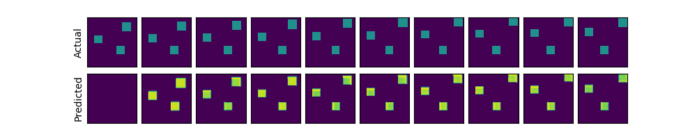

# Predicting future in gridworld simulator

This code reimplements the Prednet model (mostly copy & paste): [[Deep Predictive Coding Networks for Video Prediction and Unsupervised Learning](https://arxiv.org/abs/1605.08104)]
[[github](https://github.com/coxlab/prednet)], in gridworld sequence data.

## About the code

I adopt the source implementations mostly, except:

* Using `tf.contrib.keras` (it's all the same if you use 'TF' backends in Keras)
* Bug fixed. (extrap_start_time, see [[this](https://github.com/coxlab/prednet/pull/23)])
* New data_generator in Gridworld Simulator. The grid-world simulator simulates a free energy loss physics in a 2D scene.
* Add roi-loss.

All the hyper-parameters are in `train.py`.

Run:

`python train.py`

Evaluate:

`python evaluate.py`

## Requirements:
* Python 2
* Tensorflow 1.1 (keras in tf.contrib)
* Pygame
* Numpy

## MISC:

I completed this code when I was an intern at [Horizon Robotics](http://www.horizon-robotics.com/index_en.html).
I will greatly thank the paper of [William Lotter](https://arxiv.org/abs/1605.08104) in ICLR 2017, and his implementations:[PredNet](https://github.com/coxlab/prednet).
Also greately thanks my mentor Penghong Lin, and other colleagues (Lisen Mu, Jingchu Liu and Henglai Wei) for helpful discussion.